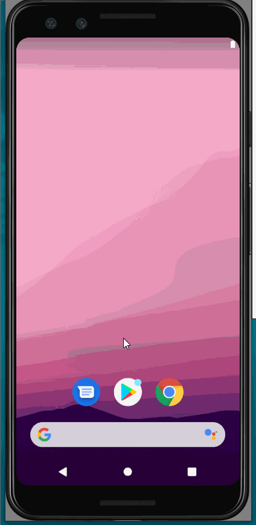
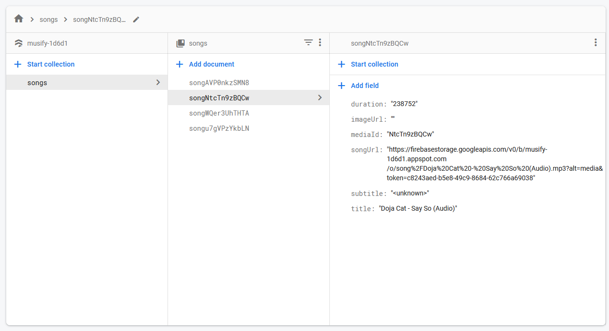
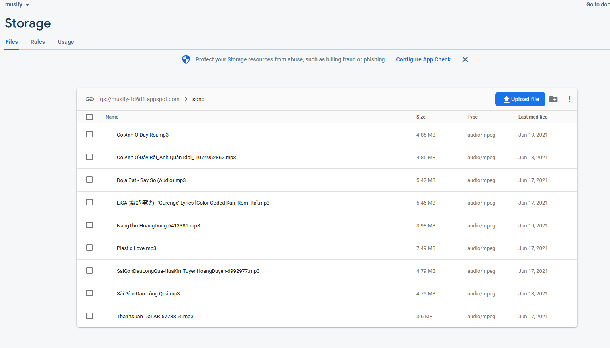

# Musify
 K17 Android Project Music App

 I.Overview: 
-Music App based on <a href="https://developer.android.com/guide/topics/media-apps/audio-app/building-an-audio-app">Android Document</a> and
<a href="https://github.com/android/uamp">UAMP</a> by google 
-Online song using firebase

II. Main function:
  1. Offline/Online Song.
  2. Player UI.
  3. Download/Upload/Delete Song.
  4. Shuffle/Repeat mode.
  5. Audio Equalizer

III. Task:  
Phạm Khắc Hoàng Tùng-1720252 : Project Structure,App Architecture  
Trần Hữu Dần-1720040 : firebase download/upload  
Nguyễn Hữu Đức-1720057: fetch song, list item  
Phạm Hồng Ân-1720025 : layout UI  
Nguyễn Văn Hải-1720078: fetch song, list item  

IV. DEMO 

 

 

